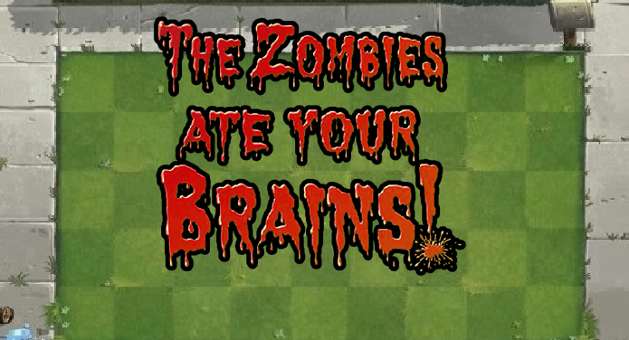

# Plantas Vs Zombies

## Equipo de desarrollo

- Micaela Plata
- Vanina Cejas
- Martina Falco
- Alan García
- Dylan Correa
- Javier Asato
  
## Capturas

## Pantalla de Inicio

## Configuración de Nivel

## Comienzo de la partida

## Partida De Ejemplo

## Partida ganada

## Game Over

## Reglas de Juego / Instrucciones
Cómo no conocés el plantas vs zombies wachín??
Tenés que plantar plantitas para defender tu casa de las oleadas de zombies

## Controles
- Comenzar partida: Enter
- Mover Cabezal: Flechas direccionales

## Otros
- Comisión C-2
- Una vez terminado, no tenemos problemas en que el repositorio sea público
